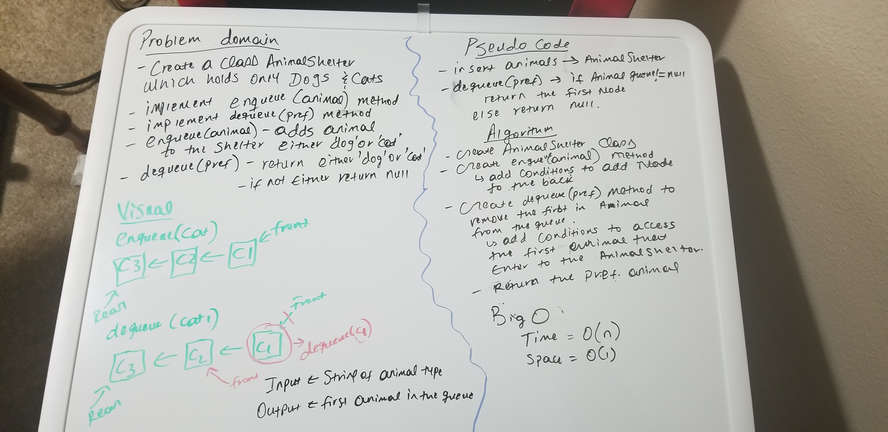

# Challenge Summary
* Create a class AnimalShelter which holds only dogs and cats
* Implement enqueue(animal) method
* Implement dequeue(pref) method
* enqueue(animal) - adds animal to the shelter either dog or cat
* dequeue(pref) - return either 'dog' or 'cat' if not either return null

## Challenge Description
* create animalshelter class
* create enqueue(animal) method
* add conditions to add node to the back
* create dequeue(pref) method to remove the first in the animal queue
* add conditions to access the first animal that enter to the animal shelter to the animalshelter.
return the pref animal 
 

## Approach & Efficiency
* all tests are passing
