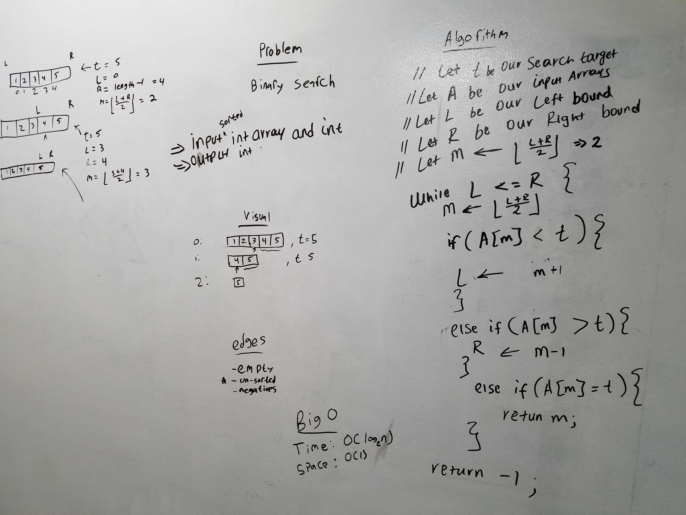

# Challenge Summary
<!--Create a function binarySearch that takes a sorted array and find the target number. -->
## Challenge Description
<!--When we have negative number and empty array -->

## Approach & Efficiency
<!-- the approach taken is comparing the middle index with the target number and move to right and left index. -->
