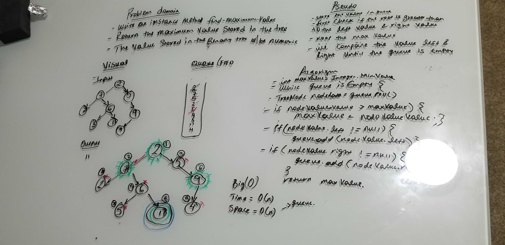

# Challenge Summary
* Write an instance method called find-maximum-value.
* return the maximum value stored in the tree. 
* You can assume that the values stored in the Binary Tree will be numeric.

## Challenge Description
* Without utilizing any of the built-in methods available to your language, 

## Approach & Efficiency
* used Queues FIFO approach 