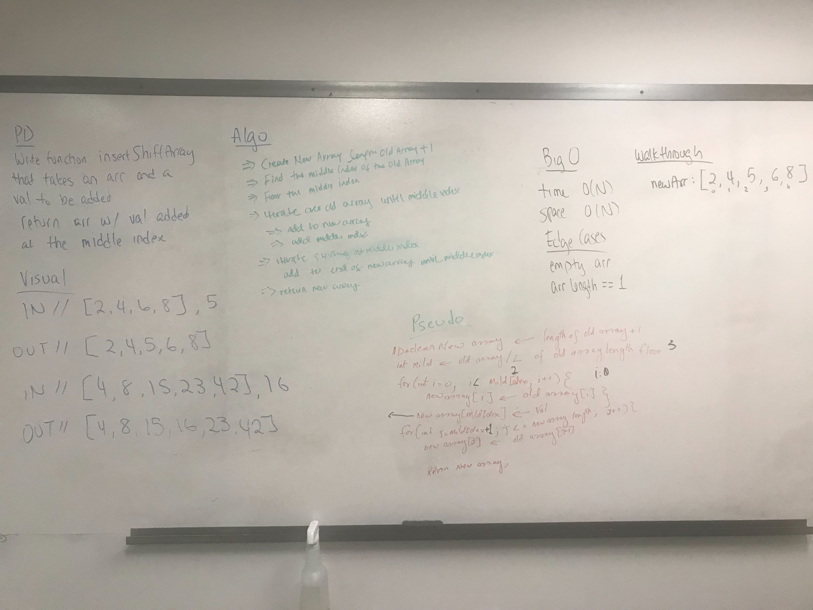

# Challenge Summary
<!--Create a function insertShiftArray which takes in an array and the value to be added.   -->

## Challenge Description
<!--how to insert the number in the array when we have even,odd, and empty array length -->

## Approach & Efficiency
<!--  i used Math.floor to in my array length so i can put the number  near index length -->

