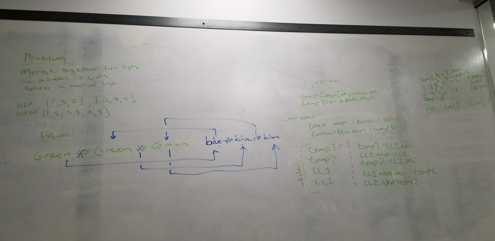

# Challenge Summary
* append value to the begining and merge two lists to one list

## Challenge Description
* check when one list is bigger than the other list and when both lists are equal

## Approach & Efficiency
* all tests are passing