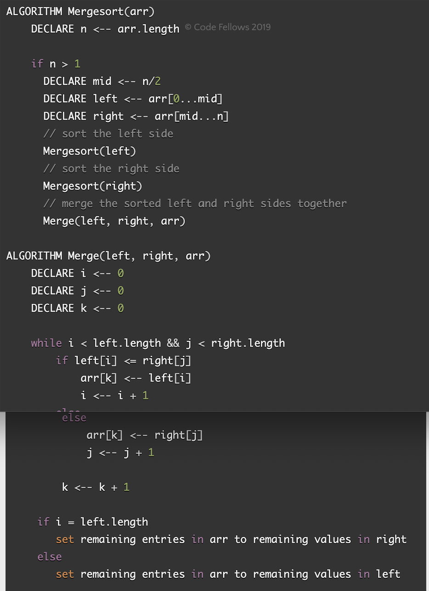

# Challenge Summary
* Merge arrays in sorted order and place it in one array

## Challenge Description
* Divide the array in to two until the size of array is less than 2

## Approach & Efficiency
* test the array if it sorted

## Read/Reference
https://www.geeksforgeeks.org/merge-sort/

## Watch
https://www.youtube.com/watch?v=TzeBrDU-JaY