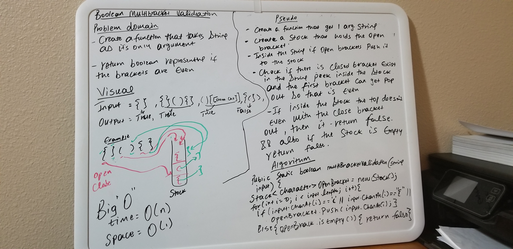

# Challenge Summary
* Create a function that get one argument string
* Return boolean representing if the brackets are even

## Challenge Description
* create a stack that holds the open bracket
* Inside the string if open brackets push it to the stack
* Check if there is a closed bracket exist in the string and peek inside the stack and the first bracket can get pop out
so that it is even

 

## Approach & Efficiency

