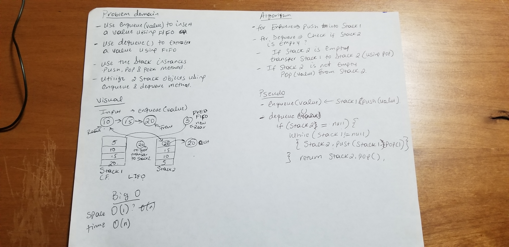

# Challenge Summary
* Use enqueue(value) to insert, the value using FIFO
* Use dequeue() to extract a value using FIFO
* Use the stack instances push, pop, and peek method
* Utilize two stack objects using enqueue and dequeue method

## Challenge Description
* for enqueue add value using push into stack 1
* for dequeue check if stact two is empty
* if stack two is empty transfer stack one to stack two using pop
* if stack two is not empty pop(value) from stack two  

## Approach & Efficiency
* all tests are passing