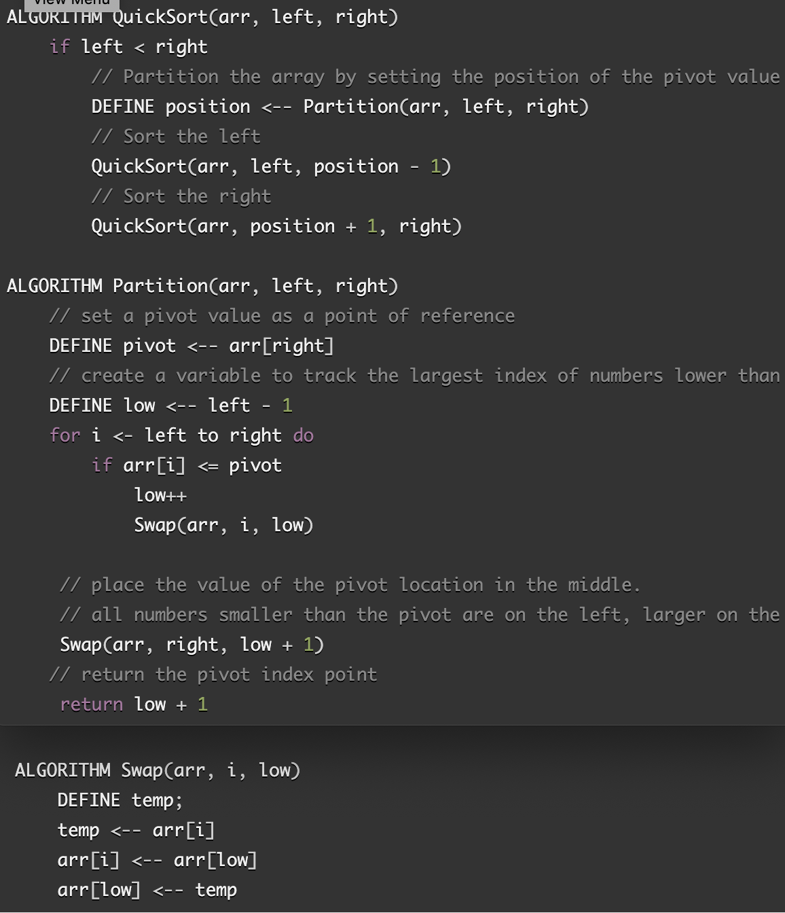

# Challenge Summary
* Quicksort place the elements of an array in order
 

## Challenge Description
* The key process in quickSort is partition(). Target of partitions is, 
given an array and an element x of array as pivot, put x at its correct 
position in sorted array and put all smaller elements (smaller than x) 
before x, and put all greater elements (greater than x) after x. 
All this should be done in linear time.

## Approach & Efficiency
* test the array if it sorted

## Read/Reference
https://www.geeksforgeeks.org/quick-sort/

## Watch
https://www.youtube.com/watch?v=COk73cpQbFQ